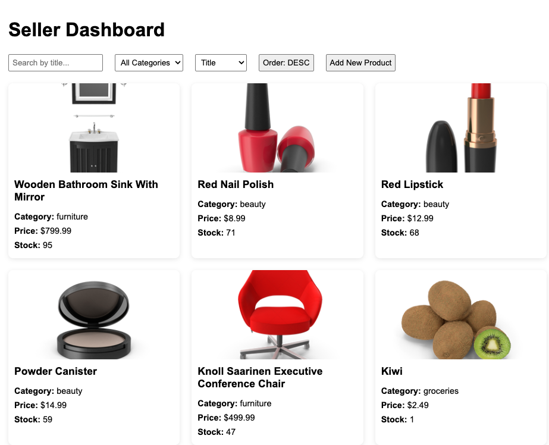
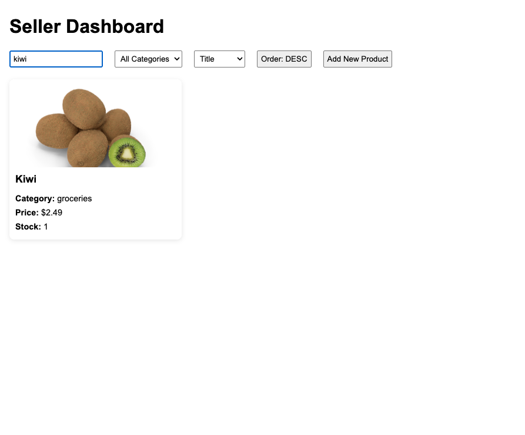
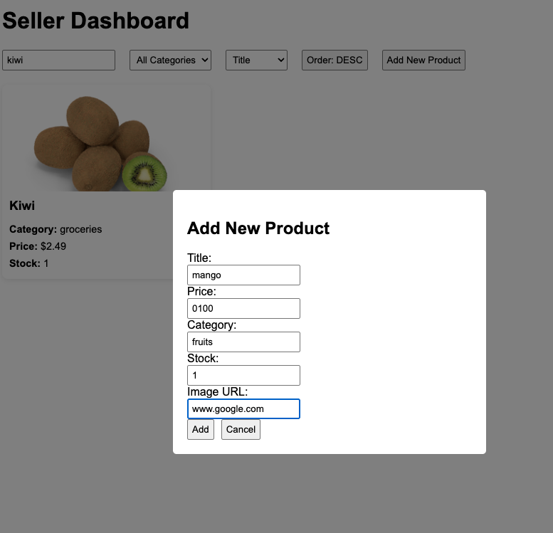
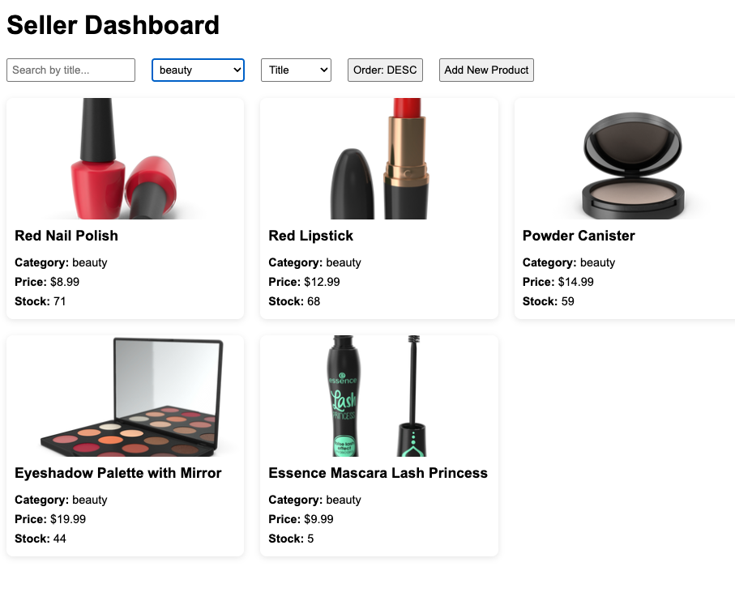

# 🛒 Seller Dashboard

A simple and modern seller dashboard to manage product listings.

---

## 🚀 Setup Instructions

1. Ensure **Node.js (v14+)** and **npm** are installed.
2. Unzip the project archive and navigate into the folder:
   ```bash
   unzip seller-dashboard.zip
   cd seller-dashboard
   ```
3. Install all dependencies:
   ```bash
   npm install
   ```
4. Start the development server:
   ```bash
   npm run dev
   ```
5. Visit **[http://localhost:3000](http://localhost:3000)** in your browser.

---

## ✨ Features

- 📦 Product listing with image, title, category, price, and stock.
- 🔍 Search functionality to find products by title.
- 🗂️ Category-based filtering.
- ↕️ Sorting options by price, stock, or title.
- ➕ Simulated "Add New Product" through a modal form.

---

## 📸 Screenshots

| Dashboard View | Search Functionality |
| :------------: | :------------------: |
|  |  |

| Add Product Modal | Filtering and Sorting |
| :---------------: | :-------------------: |
|  |  |


---
